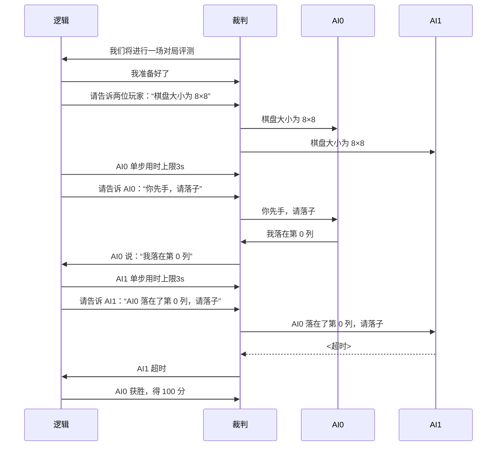

# Saiblo 游戏开发快速入门教程：以四子棋为例

## 概述

一场 Saiblo 游戏对局由三个主体组成：游戏逻辑、裁判程序和玩家 AI。游戏逻辑负责执行游戏规则，裁判程序负责通信、计时与调度，玩家 AI 则是参与游戏对局的成员。三者之间使用标准输入输出，通过管道进行交流。

一场典型的对局如下图所示：



游戏开发方需要完成的工作有：

- 基于该仓库中的逻辑模板框架，在 C++ 与 Python 中自选一种语言，完成游戏逻辑的开发；
- 参考该仓库中的 AI SDK 样例，使用 C++ 与 Python 两种语言，完成玩家友好的 AI SDK 的开发，并配备相应的文档；
- 基于该仓库中的播放器模板框架，完成游戏网页播放器的开发。

其中，网页播放器的开发已超出本教程的范畴，此处不进行具体阐述。

## 如何调试

你可以使用输出调试法进行调试。逻辑与 AI 的样例框架中均封装好了对应的类成员方法。在 C++ 框架中，你可以调用`DEBUG("message")`进行调试；在 Python 框架中，你可以调用`self._debug('message')`进行调试。

## 逻辑篇

Saiblo 上的游戏逻辑多为回合制循环驱动，可以用以下伪代码表示：

```python
while True:
    收发玩家消息()
    处理玩家回应()
    if 游戏结束:
        break
    回合数 += 1
```

### 制定通信协议

逻辑与 AI 之间要想收发消息，实现通信，必须首先制定好通信协议。**通信协议的意义在于，让逻辑与 AI 双方都能理解对方的消息。**

回顾整场对局的流程，不难发现，逻辑与 AI 之间的通讯分为这三种：

- 逻辑告诉 AI 棋盘尺寸；
- 逻辑告诉 AI 可以落子，并告知上一回合对手的行为；
- AI 将自己落子的选择告诉逻辑。

#### 简化版

出于简化考虑，我们约定棋盘尺寸固定为 8×8，这样通讯类型只分为两种。

此时，我们可以约定，逻辑与 AI 之间使用简单的整数进行通讯。

**逻辑告诉 AI 可以落子，并告知上一回合对手的行为**

逻辑向 AI 发送一个整数。如果此刻 AI 是先手第一回合，这个整数的数值为 -1；否则，这个整数的数值为对手上一回合落子的列数，**从 0 开始计数**。

**AI 将自己落子的选择告诉逻辑**

AI 向逻辑发送一个整数，表示自己本回合落子的列数，**从 0 开始计数**。

没错，就是这么简单。即便如此，这样的通信协议也是必要的。

> 入门阶段，你可以使用简化版快速上手 Saiblo 游戏开发。不过在实际的开发环节，我们通常应当采用完整版的操作。

通信协议制定完毕之后，请进入`logic`目录，参考本教程和`logic/README.md`，在`cpp`和`python`中选择一种语言，开始你的开发吧！

#### 完整版

JSON 是一种通用的消息传输格式。在 Saiblo 游戏开发中，我们通常使用 JSON 格式来制定通信协议。以下是通信示例。

**逻辑告诉 AI 棋盘尺寸**

```json
{
    "type": 0,
    "height": 8,
    "width": 8
}
```

表示棋盘的长和宽都为 8。

**逻辑告诉 AI 可以落子，并告知上一回合对手的行为**

```json
{
    "type": 1,
    "lastPos": -1
}
```

表示轮到当前玩家落子，且此刻该玩家是先手第一回合。

```json
{
    "type": 1,
    "lastPos": 5
}
```

表示轮到当前玩家落子，且上一回合对手在第 5 列落子。**列的编号从 0 开始。**

**AI 将自己落子的选择告诉逻辑**

```json
{
    "type": 2,
    "pos": 4
}
```

表示 AI 告诉逻辑，自己选择在第 4 列落子。**列的编号从 0 开始。**

通信协议制定完毕之后，请进入`logic`目录，参考本教程和`logic/README.md`，在`cpp`和`python`中选择一种语言，开始你的开发吧！

### 正式开始之前

在`logic`目录下，进入对应语言的目录后，新建一个`connect4`子目录，并在其下创建一个继承自`sdk.BaseLogic.BaseLogic`的自定义类`Connect4Logic`。此外，将`main.cpp`(C++) 或`main.py`(Python) 中的`RspLogic`改为你自定义的`Connect4Logic`。

如果你使用的语言是 C++，不要忘记在`CMakeLists.txt`中添加你创建的新文件。

> 你还会看到一个`example`子目录。这是以“石头剪刀布”为例的一份示例逻辑代码，可供参考。

>如果你使用的语言是 C++，你还会看到一个`jsoncpp`目录，内含`jsoncpp`开源库的源码，可用于解析和生成 JSON 字符串。你可以自行[查阅文档](https://open-source-parsers.github.io/jsoncpp-docs/doxygen/index.html)学习`jsoncpp`的使用。

你会发现，`BaseLogic`是一个抽象类，其中**有三个抽象方法需要实现**。接下来的教程中，我们将逐一讲解这三个抽象方法的实现要点，从而一步步搭建起四子棋的完整逻辑。

### 准备阶段

需要实现的函数：`void prepare()`(C++)、`_prepare()`(Python)。

#### 简化版

在正式进入主体回合制循环之前，逻辑可以先经过一个准备阶段。在这一阶段中，你可以进行一些代码的初始化操作。当然，你也可以什么都不做，用空函数进行实现。这一切都是你的自由。

#### 完整版

在正式进入主体回合制循环之前，逻辑可以先经过一个准备阶段。这一阶段通常包含一些代码的初始化操作。游戏开发者也可以利用这一阶段向 AI 告知一些初始化信息，例如四子棋中的棋盘尺寸信息。

`BaseLogic`提供了`singleSend(int target, const std::string &msg)`（C++)、`_single_send(target: int, msg: str)`(Python) 方法。在这一阶段中，你可以调用这一方法实现消息的发送。分别以 0 和 1 为`target`，根据制定好的通讯协议，发送同样内容的消息，告知游戏双方棋盘的尺寸信息即可。

> C++ 中可以通过`Json::Value o`创建一个空的 JSON 对象，通过`Json::FastWriter().write(o)`将 JSON 对象`o`转为字符串；Python 中可以通过`json.dumps(o)`将对象`o`转为字符串。

### 向玩家发送消息

需要实现的函数：`std::pair<int, std::string> sendMsgToPlayer(int &timeLimit, int &lengthLimit)`(C++)、`_send_msg_to_player(self) -> (int, str, Optional[int], Optional[int])`(Python)。

在主体回合制循环中，每一次迭代，逻辑都会与一名玩家进行交互，**并要求裁判程序对该玩家进行计时**。因此，在每一轮迭代开始的时候，逻辑都会调用该函数，以向该回合指定的 AI 发送消息，对它的执行时间和输出长度进行限制，监听并开始计时。

你的任务就是实现该函数，用它的返回值指定当前回合的交互对象，并向它发送一条消息。你还可以设置当前回合的 AI 最大用时限制和最长输出限制。

由于四子棋严格遵循双方你来我往的回合制规则，你可以在自己的`Connect4Logic`派生类中引入一个私有变量`turn`，表示当前轮到哪一方玩家落子，并在**每一轮迭代结束**的时候切换`turn`的数值。

对于四子棋游戏而言，在这一方法中，你只需要返回你设置的私有变量`turn`的值，以及按照约定好的通讯协议，打算发给编号为`turn`的玩家的消息内容即可。

在这一环节，你可能很想知道当前是第几回合。这时，你可以调用`getState()`(C++)、`_get_state()`(Python) 来获取当前的回合数。**回合数从 1 开始计。**

**该函数执行完毕后，逻辑会立刻要求裁判程序对指定玩家进行计时。**

如果想了解更多关于该函数的参数和返回值的信息，可参阅`logic`目录下的`README.md`（逻辑模板使用说明文档）。

### 处理玩家的回应

需要实现的函数：`handleResponse(const std::string &response, ErrorType &errorType, int &errorPlayer)`(C++)、`_handle_response(self, response: str, error_type: ErrorType, error_player: int)`(Python)。

当这一回合监听的玩家做出响应时，该方法就会被调用。如果一切正常，那么`response`的数值将是 AI 回应的内容，且`errorType`为`None`，`errorPlayer`为 -1；否则，`errorType`与`errorPlayer`的值将会是具体的异常类型和导致异常的玩家编号。

**异常处理至关重要，因为玩家 AI 很可能会发送恶意代码来炸你的逻辑。**

玩家发生的异常大体分为三类：

- 超时、运行时错误等评测层面的异常，`getTargetMessage`(C++)、`_get_target_message`(Python) 等方法会报告这类异常；
- 发送不符合通信协议的消息；
- 发送的消息符合通信协议，但不符合游戏规则。

前两类异常和部分第三类异常可以在这一阶段进行处理。

对于四子棋游戏而言，若玩家发生异常，则可在这一阶段直接判负，并跳转到“游戏结束”一节。

进行基本的异常处理之后，你就可以开始真正意义上模拟玩家的操作，执行游戏规则，进行回合结算了。

一些玩家违规的异常可能需要在这一阶段实际模拟之后才能发现，在这种情况下，**同样需要进行妥善的异常处理**。

回合结算完毕后，若有玩家获胜，则跳转到“游戏结束”一节；否则，记录这一步操作，切换`turn`的数值，准备下一轮交互。

> 为什么需要记录历史操作？一场对局完成之后，我们肯定不希望仅仅看到一个胜负的结果，更希望看到每一步每个玩家都进行了什么操作。这里就不得不提到回放文件了。
>
> 回放文件可以是一个文本文件，里面记录了每一回合的历史信息。你可以在自己的`Connect4Logic`派生类中引入一个成员变量来记录这件事，等待游戏结束时，调用`BaseLogic`基类中提供好的成员函数写入回放文件。

#### 简化版

暂无注意事项。

#### 完整版

关于 JSON 解析，有一个小提醒。玩家 AI 发来的消息可能根本不符合 JSON 语法，这种异常也是需要防范的。

C++ 中可以通过`Json::Reader().parse(str, o)`尝试将 JSON 字符串`str`转为 JSON 对象`o`，转化失败则返回`false`；Python 中可以通过`json.loads(str)`将对象`o`转为字符串，转化失败则抛出异常。

### 游戏结束

游戏正式结束之前，你需要进行两个操作：将历史记录写入回放文件，以及向裁判程序报告胜负结果。

`BaseLogic`类提供了`writeTextToReplay`(C++)、`__write_text_to_replay`(Python) 和`writeJsonToReplay`(C++)、`__write_json_to_replay`(Python) 等成员函数用于实现写入回放文件的功能，你可以直接调用。

`BaseLogic`类提供了`sendGameOverMessage`(C++)、`__send_game_over_message`(Python) 等成员函数用于向裁判程序报告胜负结果。对于四子棋游戏而言，传入函数的参数应当为一个二元向量/列表，分别表示 0 号 AI 和 1 号 AI 的得分。

**注意：该函数调用完毕后，逻辑程序将立即终止。**

关于这些函数用法更具体的描述，可参阅`logic`目录下的`README.md`（逻辑模板使用说明文档）。

到这里，你已经写出一个四子棋逻辑了。下面准备写一个简单的 AI SDK 吧！

## AI 篇

AI 与逻辑之间的通信采用的是你自己制定的通信协议，因此 AI 部分的编写自由度更大一些。只有两个用于收发消息的函数是固定的，其余部分都可以自由发挥。

该项目的`ai`目录下有 C++ 与 Python 两种语言的 AI 示例，以“石头剪刀布”为例。“石头剪刀布”与四子棋的 AI 执行流程非常相近，你可以模仿“石头剪刀布”的 AI 完成四子棋的 AI。

如果你想直接基于“石头剪刀布”的 AI 代码进行修改，你可能需要修改的文件有`sdk/Client.hpp`(C++)、`MyAI.hpp`(C++)、`sdk/Client.py`(Python)、`sdk/MyAI.py`(Python)。

实际比赛中，你还需要为选手提供一个好用的 AI SDK，不过这超出了这份教程的基本目标了，在此不再展开。

## 播放器篇

为了让你的游戏更具观赏性，你还应当实现一个**符合协议的**播放器，用来将对局以图形化的方式展示给用户，并支持人机、人人对局。这一部分有着更大的自由度，也超出了本文档的范畴。

如果你想了解更多关于播放器开发的内容，可参阅该项目内`player`目录下的有关文档以及[游戏开发者手册](https://docs.saiblo.net/developer/developer.html#_9)。
