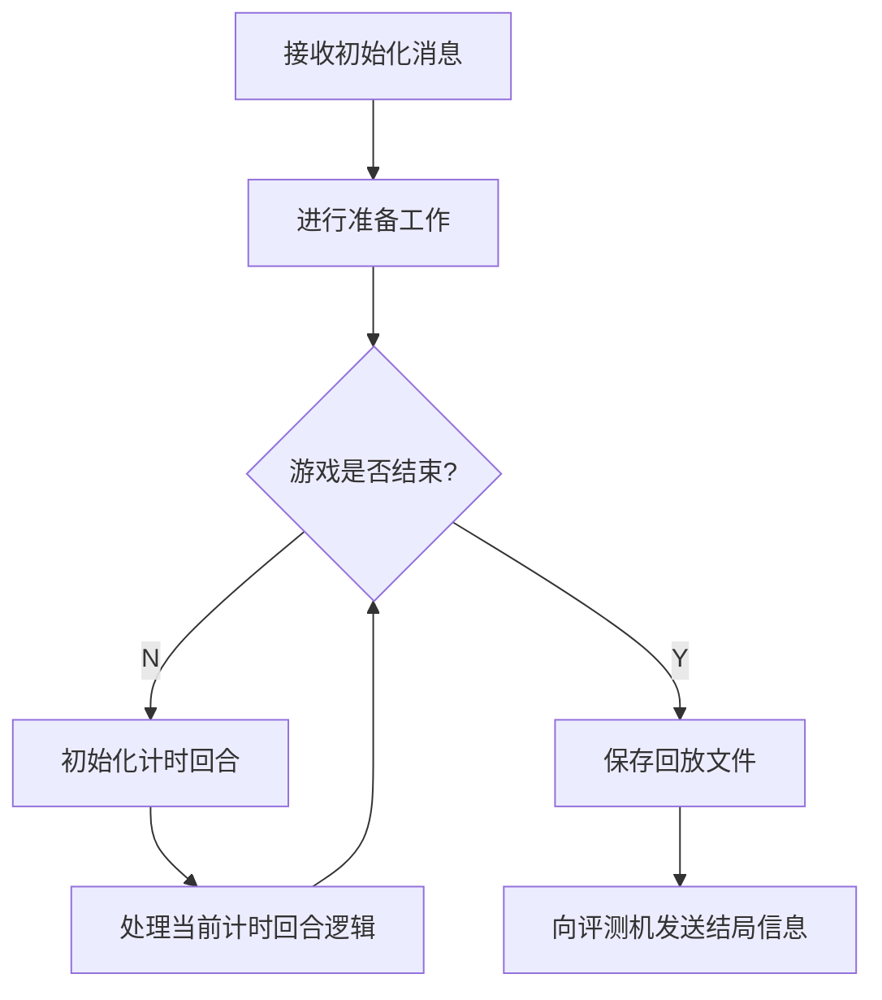

# 逻辑模板使用说明文档

> C++ 与 Python 逻辑模板除数据结构和命名风格外无显著差异，故此处合并为一份文档，基于 C++ 逻辑模板进行说明。

## 项目结构

`sdk`目录包含逻辑的抽象基类，封装了逻辑与评测机交互的代码，暴露了游戏流程函数供具体游戏逻辑实现，并提供了一些可调用的成员方法。

`example`目录下是以“石头剪刀布”为例的示例逻辑代码。游戏开发者可仿照它开发新的游戏逻辑。

C++ 逻辑模板下还提供了`jsoncpp`目录，内含`jsoncpp`开源库的源码，可用于解析和生成 JSON 字符串。游戏开发者可自行[查阅文档](https://open-source-parsers.github.io/jsoncpp-docs/doxygen/index.html)。

## 逻辑执行流程

> 可对照`BaseLogic`类的`run`方法辅助理解。

### 概念解释

**计时回合**（state）与评测机的计时流程相关，是描述单次监听计时的最小单位。**我们一般约定，在一个计时回合中，评测机只对一位玩家 AI 进行监听与计时。**因而在多数回合制游戏中，**计时回合**也是玩家交互的基本单元。

在实际游戏开发中，**我们鼓励调整游戏规则，使一个游戏回合中只有一名玩家需要交互**。这有助于减轻游戏开发者的思维难度，也有助于在比赛玩家出现异常时进行妥善的处理。游戏开发者可以通过调用[`getState()`](#getState())直接获取当前的**计时回合**数。当然，框架本身也提供了自行维护游戏回合计数的自由。

## 需要实现的方法

### `prepare()`

对应流程图中的`#2[进行准备工作]`。

它在逻辑收到评测机的初始化消息之后、进入主体回合制循环之前执行。

游戏开发者可以在`prepare()`函数中，根据实际需要，执行必要的准备工作。

**严禁在该方法中调用`anySend()`和`getTargetMessage()`！**

### `setListenTarget(int &timeLimit, int &lengthLimit)`

对应流程图中的`#4[初始化计时回合]`。

它在每个计时回合的一开始执行，用以设置该回合的监听对象、AI 执行时间上限和 AI 输出长度上限。

该方法需返回一个整数，表示当前回合需要监听消息的 AI 编号。该函数也可以返回 -1，表示当前回合不需要监听任何 AI。

通过修改`timeLimit`和`lengthLimit`的值，游戏开发者可以修改当前回合 AI 的执行时间上限和输出长度上限，单位分别为秒和字节。如果游戏开发者不对其进行设置，框架将沿用上一回合的数值。这两个数值的初始默认设置为 3 和 1024。

**一旦该方法调用结束，逻辑框架将立刻向评测机发起请求，对设置的监听对象进行监听并开始计时。**

**严禁在该方法中调用`anySend()`和`getTargetMessage()`！**

### `handleLogic()`

对应流程图中的`#5[处理当前计时回合逻辑]`。

它是游戏逻辑循环的主体部分，游戏开发者可以在其中自由实现游戏逻辑，或调用`sendGameOverMessage`方法终止游戏。

该方法的实现通常分为以下几个环节：向玩家发送消息—监听玩家回复—进行异常处理—完成回合结算。游戏开发者可以参考“石头剪刀布”的样例代码借鉴学习。