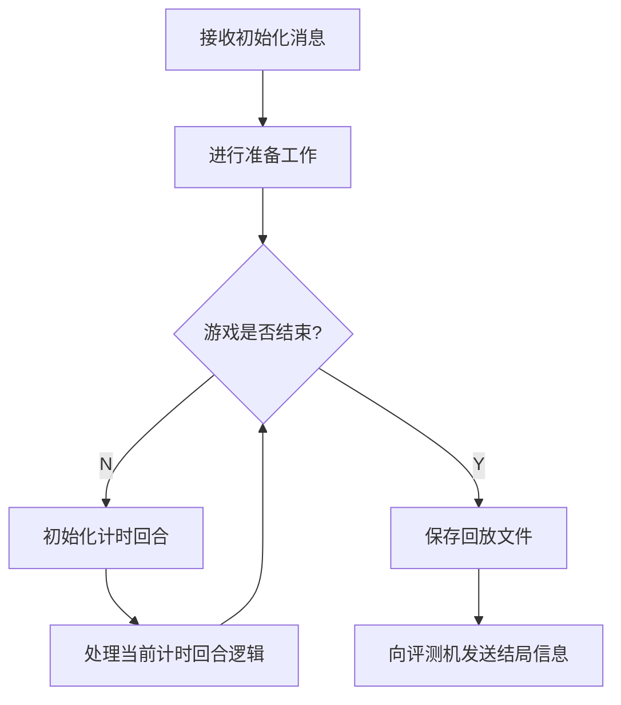

# 逻辑模板使用说明文档

> C++ 与 Python 逻辑模板除数据结构和命名风格外无显著差异，故此处合并为一份文档，基于 C++ 逻辑模板进行说明。

## 项目结构

`sdk`目录包含逻辑的抽象基类，封装了逻辑与评测机交互的代码，暴露了游戏流程函数供具体游戏逻辑实现，并提供了一些可调用的成员方法。

`example`目录下是以“石头剪刀布”为例的示例逻辑代码。游戏开发者可仿照它开发新的游戏逻辑。

C++ 逻辑模板下还提供了`jsoncpp`目录，内含`jsoncpp`开源库的源码，可用于解析和生成 JSON 字符串。游戏开发者可自行[查阅文档](https://open-source-parsers.github.io/jsoncpp-docs/doxygen/index.html)。

## 逻辑执行流程

> 可对照`BaseLogic`类的`run`方法辅助理解。

