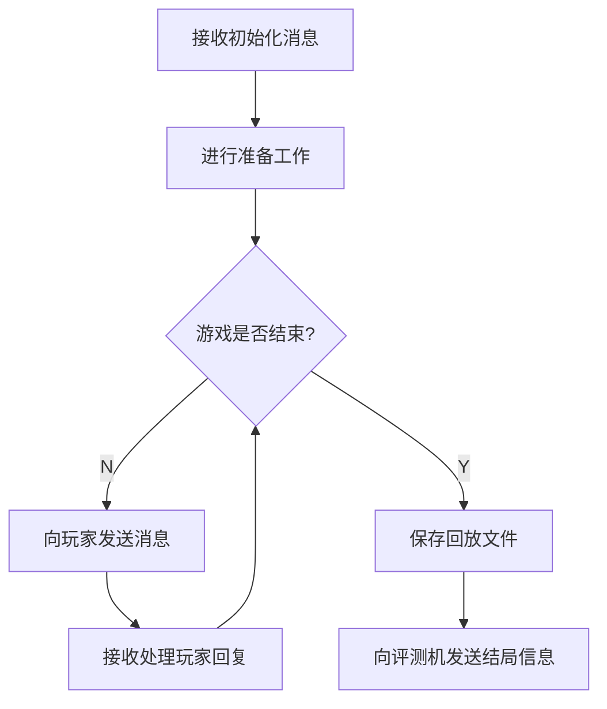

# 逻辑模板使用说明文档

> C++ 与 Python 逻辑模板除数据结构和命名风格外无显著差异，故此处合并为一份文档，基于 C++ 逻辑模板进行说明。

## 项目结构

`sdk`目录包含逻辑的抽象基类，封装了逻辑与评测机交互的代码，暴露了游戏流程函数供具体游戏逻辑实现，并提供了一些可调用的成员方法。

`example`目录下是以“石头剪刀布”为例的示例逻辑代码。游戏开发者可仿照它开发新的游戏逻辑。

C++ 逻辑模板下还提供了`jsoncpp`目录，内含`jsoncpp`开源库的源码，可用于解析和生成 JSON 字符串。游戏开发者可自行[查阅文档](https://open-source-parsers.github.io/jsoncpp-docs/doxygen/index.html)。

## 逻辑执行流程

> 我们约定：每一回合游戏逻辑只与一名玩家发生交互。



## 需要实现的方法

### `prepare()`

对应流程图中的`#2[进行准备工作]`。

它在逻辑收到评测机的初始化消息之后、进入主体回合制循环之前执行。

游戏开发者可以在`prepare()`方法中，根据实际需要，执行必要的准备工作。

### `sendMsgToPlayer(int &timeLimit, int &lengthLimit)`

对应流程图中的`#4[向玩家发送消息]`。

它在每个回合的一开始执行，用以向该回合所监听的 AI 发送消息，并设置该 AI 的执行时间上限和输出长度上限。

**C++ 版：**

该方法需返回一个<整数, 字符串>对，表示当前回合需要监听消息的 AI 编号，以及需要向它发送的消息内容。

通过修改`timeLimit`和`lengthLimit`的值，游戏开发者可以修改当前回合 AI 的执行时间上限和输出长度上限，单位分别为秒和字节。如果游戏开发者不对其进行设置，框架将沿用上一回合的数值。这两个数值的初始默认设置为 3 和 1024。

一旦该方法调用结束，逻辑框架会立刻将该方法返回的消息内容发给指定的 AI，并向评测机发起请求，对所指定的 AI 进行监听并开始计时。

如果在该阶段只发送一次消息并不能满足游戏需求，游戏开发者可以在该方法内额外调用任意多次`singleSend`方法，它们的消息会先于`sendMsgToPlayer`的返回值而发出。

**Python 版：**

方法签名改为

```python
_send_msg_to_player(self) -> (int, str, Optional[int], Optional[int])
```

该方法需返回一个四元组，第一个元素表示当前回合需要发送并监听消息的 AI 编号，第二个元素表示需要发送的消息内容，后两个元素依次表示该回合 AI 的执行时间上限和输出长度上限，单位分别为秒和字节。

如果该回合不需要调整时间或长度上限，返回值的对应元素改为`None`即可。这两个数值的初始默认设置为 3 和 1024。

一旦该方法调用结束，逻辑框架会立刻将该方法返回的消息内容发给指定的 AI，并向评测机发起请求，对所指定的 AI 进行监听并开始计时。

如果在该阶段只发送一次消息并不能满足游戏需求，游戏开发者可以在该方法内额外调用任意多次`_single_send`方法，它们的消息会先于`_send_msg_to_player`的返回值而发出。

### `handleResponse(const std::string &response, ErrorType &errorType, int &errorPlayer)`

对应流程图中的`#5[接收处理玩家回复]`。

当这一回合所监听的 AI 发来消息或出现异常时，这一方法会被调用，游戏开发者需要对 AI 的回应进行处理。

**游戏开发者有义务对玩家发来的消息进行异常处理。**

该方法接受三个参数。当 AI 正常发来消息时，第一个参数表示消息的内容，第二个参数取值为`NONE`，第三个参数取值为 -1；当 AI 出现异常时，第一个参数表示错误信息，第二个参数表示错误类型，第三个参数表示发生错误的玩家编号。

游戏开发者可以在该方法内调用任意多次`singleSend`方法。

## 可供调用的方法

### `getState()`

返回一个整数，表示当前的回合数`state`。

`state`是一个`BaseLogic`类的私有变量，它由框架本身负责维护，游戏开发者不得随意修改它的数值，因此需要通过只读的`getState()`方法进行访问。

`state`的初始值为 1。每当一个回合的循环结束时，`state`的数值会增加 1。

### `writeTextToReplay(const std::string &text)`

向回放文件中写入文本。

在本框架中，游戏回放文件使用覆盖写的方式打开。因此后调用的`writeTextToReplay`和`writeJsonToReplay`写入的文本会将先调用的写入的内容覆盖掉。

### `writeJsonToReplay(const Json::Value &json)`

向回放文件中写入 JSON 对象。

在本框架中，游戏回放文件使用覆盖写的方式打开。因此后调用的`writeTextToReplay`和`writeJsonToReplay`写入的文本会将先调用的写入的内容覆盖掉。

### `singleSend(int target, const std::string &msg)`

向指定的一个玩家发送消息。

`target`表示目标 AI 的序号，`msg`表示发送的消息内容。

### `sendGameOverMessage(const std::vector<int> &scores)`

游戏结束时，向评测机发送各玩家的得分，并告知评测机本场对局可以终止了。

`scores`是玩家得分的向量，按玩家编号从小到大的顺序依次表示各玩家的分数。

该方法执行完毕后，逻辑进程会立刻终止。因此，**在调用该方法之前，请务必确保所有操作（尤其是 IO 操作，如写入回放文件）已经完成**。

## 可供使用的成员变量

### `std::default_random_engine rng`

> 仅在 C++ 框架中可用。

随机引擎，使用`std::random_device()`作为种子。

游戏开发者也可以不使用框架提供的随机引擎。

### `std::vector<PlayerStatus> playerStatus`

玩家状态的数组，按照玩家编号从小到大排序。

0 表示玩家进入游戏失败，1 表示玩家是本地 AI，2 表示玩家使用了网页播放器。

## 如何调试

你可以使用输出调试法进行调试。样例框架中封装好了对应的类成员方法。在 C++ 框架中，你可以调用`DEBUG("message")`进行调试；在 Python 框架中，你可以调用`self._debug('message')`进行调试。

## 示例游戏：石头剪刀布

### 说明

“石头剪刀布”并不是一个合适的 Saiblo 游戏，因为游戏玩家双方原则上需要同时给出他们的手势，该游戏并不是严格回合制驱动的。

在该示例中，选用这一游戏的原因是，它的逻辑非常好写。此外，强行将单次比拼拆为先后手进行交互，保证逻辑不将先手出了什么手势告诉后手，即可将“石头剪刀布”适配为一个回合制驱动的游戏。当然，这一改动会带来一个异常处理方面的问题。

### 值得思考的问题

- 考虑两个玩家 AI 在同一轮比拼中均发生了某种异常的情形。按照回合制驱动“石头剪刀布”游戏的规则设计，先手的错误会首先告知逻辑。按照目前的逻辑实现，先手会立刻判负，但可以想见，这种处理有失公平。你能想办法解决这一问题吗？你的解决方案会不会引入新的问题？
- 阅读逻辑代码可以发现，该游戏采取了“五局三胜”制。然而，当前逻辑存在一个严重的漏洞，玩家可以构造一种极简单的 AI 算法对游戏逻辑进行攻击。你能想到是什么漏洞吗？

以上两个问题均能提醒游戏开发者，对异常的妥善处理是一件必须谨慎对待的事。

### 通信协议示例

> “石头剪刀布”的规则非常简单，因此逻辑与 AI 采用简单的文本即可实现通信。然而在真正的游戏开发中，逻辑与 AI 之间通常采用更加结构化的格式（例如 JSON）进行通信。游戏开发者可以参考 Saiblo 上其他游戏的通信协议进行学习。

约定：石头、剪刀、布分别用 rock、scissors 和 paper 指代。

每轮比拼开始时，逻辑会向进行交互的玩家发送一个单词的指令提示比拼开始。首轮比拼开始时，逻辑向玩家发送的指令内容为`"ready"`；随后的每轮比拼开始时，逻辑向玩家发送的指令内容均为上一轮比拼中对手给出的手势。

玩家 AI 收到逻辑发来的指令后，需要回复它在该轮比拼中给出的手势。回复的内容同样为 rock、scissors 和 paper 三个单词中的一个。
