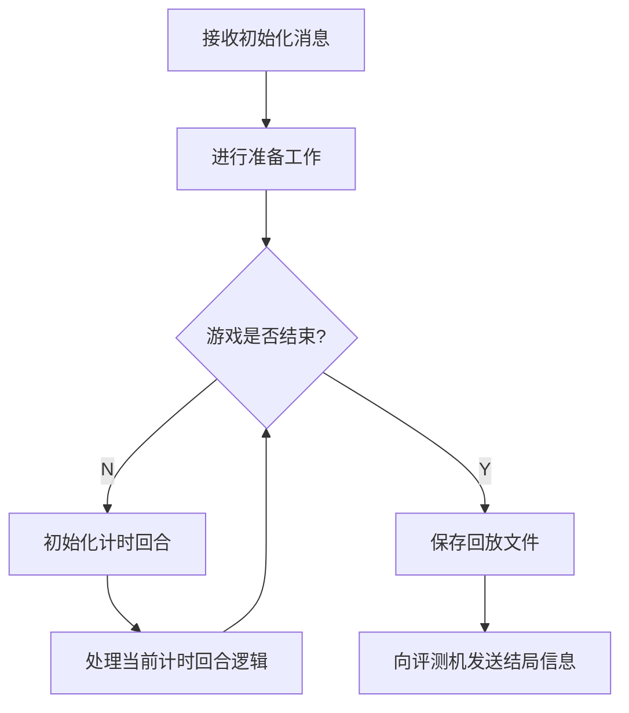

# 逻辑模板使用说明文档

> C++ 与 Python 逻辑模板除数据结构和命名风格外无显著差异，故此处合并为一份文档，基于 C++ 逻辑模板进行说明。

## 项目结构

`sdk`目录包含逻辑的抽象基类，封装了逻辑与评测机交互的代码，暴露了游戏流程函数供具体游戏逻辑实现，并提供了一些可调用的成员方法。

`example`目录下是以“石头剪刀布”为例的示例逻辑代码。游戏开发者可仿照它开发新的游戏逻辑。

C++ 逻辑模板下还提供了`jsoncpp`目录，内含`jsoncpp`开源库的源码，可用于解析和生成 JSON 字符串。游戏开发者可自行[查阅文档](https://open-source-parsers.github.io/jsoncpp-docs/doxygen/index.html)。

## 逻辑执行流程

> 可对照`BaseLogic`类的`run`方法辅助理解。

### 概念解释

**计时回合**（state）与评测机的计时流程相关，是描述单次监听计时的最小单位。**我们一般约定，在一个计时回合中，评测机只对一位玩家 AI 进行监听与计时。**因而在多数回合制游戏中，**计时回合**也是玩家交互的基本单元。

在实际游戏开发中，**我们鼓励调整游戏规则，使一个游戏回合中只有一名玩家需要交互**。这有助于减轻游戏开发者的思维难度，也有助于在比赛玩家出现异常时进行妥善的处理。游戏开发者可以通过调用[`getState()`](#getState())直接获取当前的**计时回合**数。当然，框架本身也提供了自行维护游戏回合计数的自由。

## 注意点汇总

这些注意点会在后续文档中提到，汇总在此处以方便提示和查阅。

- 一些方法禁止组合调用，游戏开发者务必遵守文档中描述的规范。
- 对于逻辑希望发给 AI 的消息，评测机只会进行原封不动的转发。
- 对于逻辑接收到的 AI 消息，逻辑有义务进行各种异常处理。
- 在游戏逻辑发送结束消息之前，请务必确保所有操作（尤其是 IO 操作，如写入回放文件）已经完成。

## 需要实现的方法

### `prepare()`

对应流程图中的`#2[进行准备工作]`。

它在逻辑收到评测机的初始化消息之后、进入主体回合制循环之前执行。

游戏开发者可以在`prepare()`方法中，根据实际需要，执行必要的准备工作。

**严禁在该方法中调用`anySend()`和`getTargetMessage()`！**

### `setListenTarget(int &timeLimit, int &lengthLimit)`

对应流程图中的`#4[初始化计时回合]`。

它在每个计时回合的一开始执行，用以设置该回合的监听对象、AI 执行时间上限和 AI 输出长度上限。

该方法需返回一个整数，表示当前回合需要监听消息的 AI 编号。该方法也可以返回 -1，表示当前回合不需要监听任何 AI。

通过修改`timeLimit`和`lengthLimit`的值，游戏开发者可以修改当前回合 AI 的执行时间上限和输出长度上限，单位分别为秒和字节。如果游戏开发者不对其进行设置，框架将沿用上一回合的数值。这两个数值的初始默认设置为 3 和 1024。

**一旦该方法调用结束，逻辑框架将立刻向评测机发起请求，对设置的监听对象进行监听并开始计时。**

**严禁在该方法中调用`anySend()`和`getTargetMessage()`！**

### `handleLogic()`

对应流程图中的`#5[处理当前计时回合逻辑]`。

它是游戏逻辑循环的主体部分，游戏开发者可以在其中自由实现游戏逻辑，或调用`sendGameOverMessage`方法终止游戏。

该方法的实现通常分为以下几个环节：向玩家发送消息—监听玩家回复—进行异常处理—完成回合结算。游戏开发者可以参考“石头剪刀布”的样例代码借鉴学习。

## 可供调用的方法

### `getState()`

返回一个整数，表示当前的计时回合数`state`。

`state`是一个`BaseLogic`类的私有变量，它由框架本身负责维护，游戏开发者不得随意修改它的数值，因此需要通过只读的`getState()`方法进行访问。

`state`的初始值为 1。每当一个计时回合的循环结束时，`state`的数值会增加 1。

### `writeTextToReplay(const std::string &text)`

向回放文件中写入文本。

在本框架中，游戏回放文件使用覆盖写的方式打开。因此后调用的`writeTextToReplay`和`writeJsonToReplay`写入的文本会将先调用的写入的内容覆盖掉。

### `writeJsonToReplay(const Json::Value &json)`

向回放文件中写入 JSON 对象。

在本框架中，游戏回放文件使用覆盖写的方式打开。因此后调用的`writeTextToReplay`和`writeJsonToReplay`写入的文本会将先调用的写入的内容覆盖掉。

### `singleSend(int target, const std::string &msg)`

向指定的一个玩家发送消息。**消息的内容会原封不动地发给对应的 AI。**比如如果`msg`为`aglove`，那么目标 AI 也只会收到原封不动的`aglove`。

`target`表示目标 AI 的序号，`msg`表示发送的消息内容。

### `anySend(const std::vector<std::pair<int, std::string>> &messages)`

一次性向任意数量的玩家（可以为空）发送消息。具体的实现遵循[游戏开发者手册](https://docs.saiblo.net/developer/developer.html#judger_2)中描述的协议，游戏开发者一般不用关心。

`messages`为<整数, 字符串>对组成的向量，每一对<整数, 字符串>表示需要发送消息的 AI 编号和消息内容。**消息的内容会原封不动地发给对应的 AI。**

**严禁在`prepare`和`setListenTarget`中调用该方法！**

### `getTargetMessage(ErrorType &errorType, int &errorPlayer)`

返回一个字符串，正常情况下表示从监听对象处接受到的一条消息。

`errorType`可以用于判断监听对象是否发生了异常。若`errorType`的值为`NONE`，则表示没有异常发生；否则`errorType`表示相应的错误类型，且`errorPlayer`会被修改为发生错误的玩家编号，此外，该方法会返回错误信息（但这个错误信息一般没有用）。

**严禁在`prepare`和`setListenTarget`中调用该方法！**

### `sendGameOverMessage(const std::vector<int> &scores)`

游戏结束时，向评测机发送各玩家的得分，并告知评测机本场对局可以终止了。

`scores`是玩家得分的向量，按玩家编号从小到大的顺序依次表示各玩家的分数。

该方法执行完毕后，逻辑进程会立刻终止。因此，**在调用该方法之前，请务必确保所有操作（尤其是 IO 操作，如写入回放文件）已经完成**。

## 可供使用的成员变量

### `std::default_random_engine rng`

随机引擎，使用`std::random_device()`作为种子。

游戏开发者也可以不使用框架提供的随机引擎。

### `std::vector<PlayerStatus> playerStatus`

玩家状态的数组，按照玩家编号从小到大排序。

0 表示玩家进入游戏失败，1 表示玩家是本地 AI，2 表示玩家使用了网页播放器。

## 示例游戏：石头剪刀布

### 说明

“石头剪刀布”并不是一个合适的 Saiblo 游戏，因为游戏玩家双方原则上需要同时给出他们的手势，该游戏并不是严格回合制驱动的。

在该示例中，选用这一游戏的原因是，它的逻辑非常好写。此外，强行将单次比拼拆为先后手进行交互，保证逻辑不将先手出了什么手势告诉后手，即可将“石头剪刀布”适配为一个回合制驱动的游戏。当然，这一改动会带来一个异常处理方面的问题。

### 值得思考的问题

- 考虑两个玩家 AI 在同一轮比拼中均发生了某种异常的情形。按照回合制驱动“石头剪刀布”游戏的规则设计，先手的错误会首先告知逻辑。按照目前的逻辑实现，先手会立刻判负，但可以想见，这种处理有失公平。你能想办法解决这一问题吗？你的解决方案会不会引入新的问题？
- 阅读逻辑代码可以发现，该游戏采取了“五局三胜”制。然而，当前逻辑存在一个严重的漏洞，玩家可以构造一种极简单的 AI 算法对游戏逻辑进行攻击。你能想到是什么漏洞吗？

以上两个问题均能提醒游戏开发者，对异常的妥善处理是一件必须谨慎对待的事。

### 通信协议示例

> “石头剪刀布”的规则非常简单，因此逻辑与 AI 采用简单的文本即可实现通信。然而在真正的游戏开发中，逻辑与 AI 之间通常采用更加结构化的格式（例如 JSON）进行通信。游戏开发者可以参考 Saiblo 上其他游戏的通信协议进行学习。

约定：石头、剪刀、布分别用 rock、scissors 和 paper 指代。

每轮比拼开始时，逻辑会向进行交互的玩家发送一个单词的指令提示比拼开始。**指令以`'\n'`结尾，以方便玩家 AI 判断指令的结束。**首轮比拼开始时，逻辑向玩家发送的指令内容为`"ready\n"`；随后的每轮比拼开始时，逻辑向玩家发送的指令内容均为上一轮比拼中对手给出的手势（同样需要以`'\n'`结尾）。

玩家 AI 收到逻辑发来的指令后，需要回复它在该轮比拼中给出的手势。**回复的内容仅为三个单词中的一个，不包含任何`'\n'`等额外符号作为结尾。**（如果说有什么附加内容，那也是根据[游戏开发者手册](https://docs.saiblo.net/developer/developer.html#ai-judger-4n)中描述的 4 字节的包头。但是这已由模板 AI SDK 预先封装好。）